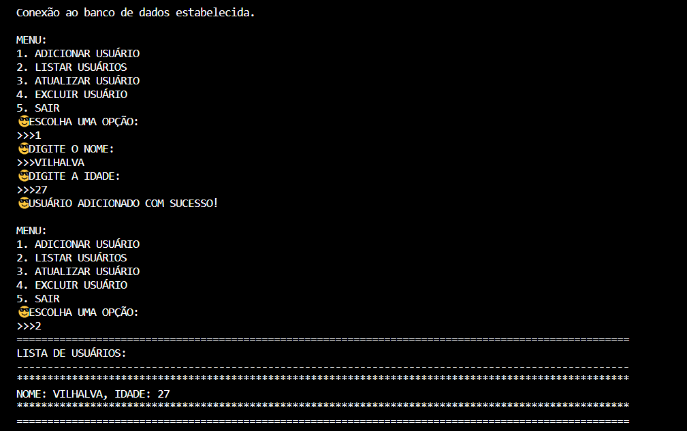
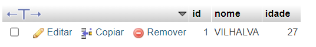

# CRUD PYTHON EM MYSQL
🎈GERENCIE O NOME E IDADE DOS USUÁRIOS EM UM ARQUIVO MYSQL.

 <br>
 <br>

## DESCRIÇÃO:
Este aplicativo é um gerenciador de usuários que permite adicionar, listar, atualizar e excluir informações de usuários armazenadas em um banco de dados MySQL [CRUD](./CRUD.md). Ele foi projetado para fornecer uma interface simples e interativa para manipular os dados dos usuários.

Funcionalidades principais:

1. **Adicionar Usuário**: Permite adicionar um novo usuário ao banco de dados, fornecendo o nome e a idade do mesmo.

2. **Listar Usuários**: Apresenta uma lista de todos os usuários cadastrados no banco de dados, mostrando seus nomes e idades.

3. **Atualizar Usuário**: Permite atualizar as informações de um usuário existente no banco de dados, substituindo o nome e/ou a idade pelo novo valor fornecido.

4. **Excluir Usuário**: Remove um usuário específico do banco de dados com base no nome fornecido.

O aplicativo fornece um menu intuitivo para o usuário interagir com essas funcionalidades. Ele utiliza a linguagem de programação Python e o conector MySQL para estabelecer a conexão com o banco de dados e executar as operações de manipulação de dados.

Essa aplicação é útil em cenários onde é necessário armazenar e gerenciar informações de usuários de forma eficiente, como em sistemas de cadastro, administração de usuários em plataformas web, entre outros.

## COMO USAR?
### BAIXANDO O PROJETO:
**Passo 1:** Clone o repositório para o seu sistema local.

```bash
git clone https://github.com/VILHALVA/CRUD-PYTHON-EM-MYSQL.git
```

**Passo 2:** Navegue até o diretório do projeto.

```bash
cd CRUD-PYTHON-EM-MYSQL
```

**Passo 3:** Descompacte o arquivo ZIP (se você baixou manualmente):

```bash
unzip CRUD-PYTHON-EM-MYSQL.zip
```

### EXECUTANDO O APP:
* **Crie o Database MySQL:**
   - Antes de você executar o script ou o executavel, você precisa conectar e criar seu banco de dados. Você pode importar o arquivo `DATABASE.sql` ou digitar os seguintes comandos:
   ```sql
   CREATE DATABASE cadastro;
   ```

   ```sql
   USE cadastro;
   CREATE TABLE usuarios (
      id INT AUTO_INCREMENT PRIMARY KEY,
      nome VARCHAR(255) NOT NULL,
      idade INT
   );
   ```

   - Isso criará uma tabela chamada usuarios com três colunas: id, nome e idade. O id será uma chave primária auto incrementada, garantindo unicidade para cada usuário. O nome é uma string de até 255 caracteres e idade é um número inteiro.

#### SCRIPT PYTHON:
- Para executar o código Python `(CODIGO.py)` em um PC zerado, ou seja, em um computador onde o Python não está instalado, você precisará seguir alguns passos adicionais para configurar o ambiente de execução. Aqui está um guia básico para isso:

1. **Baixe e Instale o Python:**
   - A primeira etapa é baixar o instalador do Python para o seu sistema operacional. Você pode encontrar o instalador oficial em [python.org](https://www.python.org/downloads/).
   - Se você estiver usando o Windows, certifique-se de baixar a versão adequada para o seu sistema operacional (32 bits ou 64 bits).
   - Siga as instruções do instalador para instalar o Python no seu PC.

2. **Configuração das Variáveis de Ambiente (opcional):**
   - No Windows, é uma boa prática adicionar o diretório de instalação do Python ao PATH do sistema. Isso permite que você execute comandos Python de qualquer diretório no prompt de comando.
   - Para fazer isso, após a instalação, procure "Variáveis de Ambiente" nas configurações do sistema, e adicione o caminho para o diretório de instalação do Python (normalmente algo como C:\PythonXX, onde XX é a versão do Python).

3. **Transferindo o Script para o PC:**
   - Transfira o arquivo `nome-do-arquivo.py` para o PC. Isso pode ser feito por meio de um pen drive, rede local, ou qualquer outro método de transferência de arquivo.

4. **Instalando Dependências:**
   - Você precisará instalar o conector MySQL para Python:
   ```bash
   pip install mysql-connector-python
   ``` 

5. **Edite o código:**
   - Certifique-se de substituir 'seu_host', 'sua_base_de_dados', 'seu_usuario' e 'sua_senha' pelos detalhes do seu banco de dados MySQL.

6. **Executando o Script:**
   - Abra um prompt de comando (no Windows, pressione `Win + R`, digite "cmd" e pressione Enter).
   - Navegue até o diretório onde o `nome-do-arquivo.py` está localizado usando o comando `cd` (por exemplo, `cd C:\Caminho\Para\O\nome-do-arquivo.py`).
   - Execute o script digitando `python nome-do-arquivo.py` e pressionando Enter.

Seguindo esses passos, você poderá executar o seu script Python em um PC zerado, mesmo sem ter o Python instalado anteriormente. Certifique-se de que todas as dependências do script estejam instaladas e que o Python esteja configurado corretamente no seu sistema. Se você não estiver familiarizado com esses passos, confira nosso [curso completo sobre o Python](https://github.com/VILHALVA/CURSO-DE-PYTHON) e [curso completo de MySQL](https://github.com/VILHALVA/CURSO-DE-MYSQL) para obter orientações detalhadas.

#### O EXECUTAVEL:
1. **Localize o Arquivo:** Após o download, localize o arquivo executável no seu sistema. Geralmente, os downloads são salvos na pasta "Downloads" do seu computador, mas você pode tê-lo salvo em outro local.

2. **Duplo Clique:** Para executar o arquivo, basta dar um duplo clique sobre ele. Isso abrirá o programa associado ao arquivo. Se o arquivo for um instalador, ele iniciará o processo de instalação. Se for um programa independente, ele será iniciado.

3. **Compatibilidade:** Certifique-se de que o executável seja compatível com a versão do seu sistema operacional. Se você estiver usando um sistema operacional Windows x64, o executável deve ser compilado para x64 para funcionar corretamente. Isso é importante porque o sistema operacional x64 não pode executar aplicativos compilados apenas para x86 (32 bits).

4. **Dependências:** Verifique se o executável depende de algum software adicional ou bibliotecas para funcionar corretamente. Às vezes, você pode precisar instalar outras ferramentas ou componentes antes de executar o executável.

5. **Configurações de Segurança:** Se o seu sistema operacional estiver configurado para bloquear a execução de aplicativos de fontes desconhecidas ou não confiáveis, você pode precisar ajustar as configurações de segurança para permitir a execução do executável.

6. **Atualizações e Patches:** Por fim, verifique se há atualizações ou patches para o executável, especialmente se for um software de terceiros. As atualizações podem corrigir problemas conhecidos ou adicionar novos recursos ao programa.

## SAIBA MAIS:
- [PROJETO CRIADO PELO VILHALVA](https://github.com/VILHALVA)
- [FAÇA OS NOSSOS CURSOS](https://github.com/VILHALVA?tab=repositories&q=+topic:CURSO)


